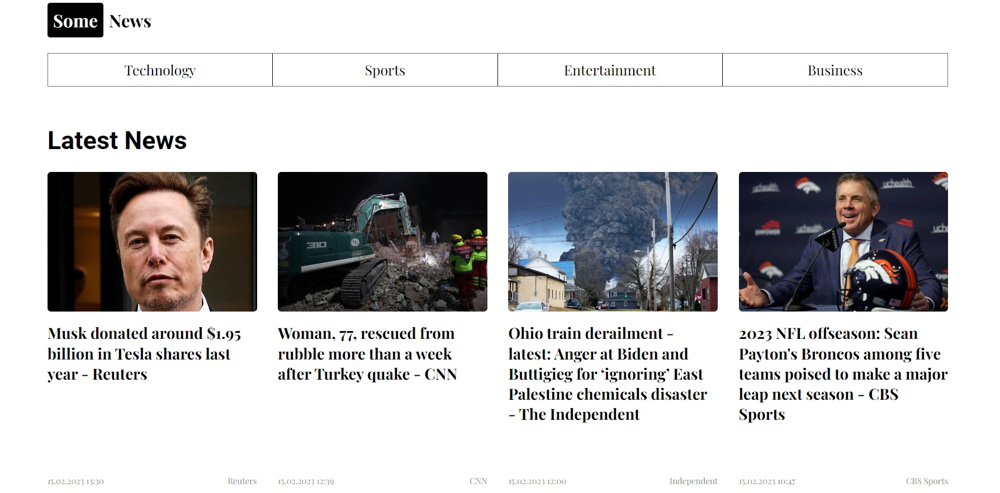
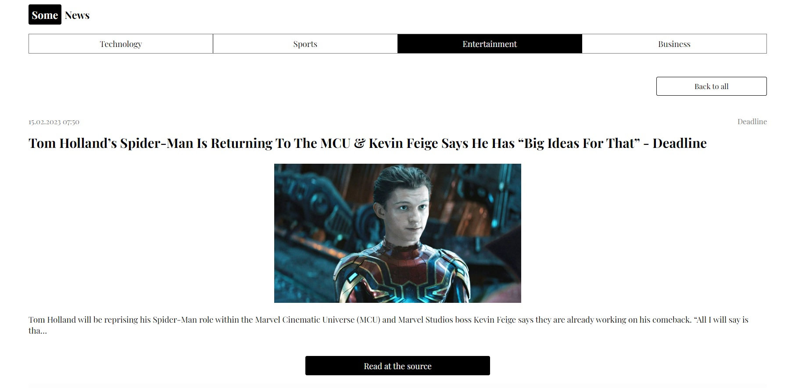

# Новостной портал «Some news» (News API)

### Описание: React-приложение для чтения новостей, получаемых в режиме реального времени из различных новостных истоников, предлагаемых News API.
### Реализованный функционал:
* Загрузка последних новостей на общую тематику.

<!--    -->

* Загрузка новостей определенной тематики в зависимости от выбранной в шапке категории (technology, sports, entertainment, business).

<!--  -->

* Страница с выбранной новостью, имеющая после описания ссылку с возможностью продолжить чтение в источнике.

<!--  -->

### Использованные технологии:
* HTML
* CSS
* Javascript
* React
* Redux Toolkit
* Ajax
* Styled Components